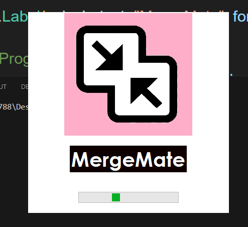
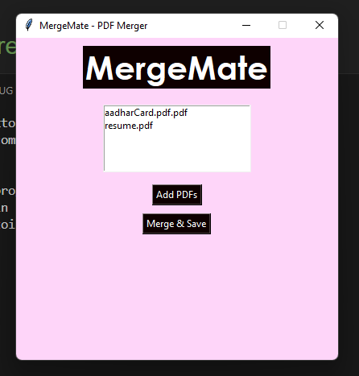

# 📄 MergeMate – A Simple PDF Merger GUI App

**MergeMate** is a lightweight desktop application built using Python and Tkinter. It allows users to merge multiple PDF files into a single file with just a few clicks. The app includes a modern UI, splash screen, progress indicator, and uses the powerful `PyPDF2` library to handle PDF operations.

---

## 🖼️ Features

- ✅ Graphical User Interface using `Tkinter`
- ✅ Elegant splash screen at launch
- ✅ Merge multiple PDF files into one
- ✅ File selection with drag-and-drop-like UX (via file dialogs)
- ✅ Progress bar for better feedback
- ✅ Custom name for the output PDF
- ✅ Simple and minimalistic design

## 📸 ScreenShots 
 
  

## 🚀 How It Works

### 📦 Libraries Used:
- `tkinter` – To create the GUI components.
- `ttk` – For themed widgets like `Progressbar`.
- `PyPDF2` – To read and write PDF files.

### 🔧 PyPDF2 Usage
The app uses **PyPDF2** to:
- Read input PDF files via `PdfReader()`
- Append each page from the selected PDFs into a `PdfWriter()`
- Save the merged PDF with a custom filename using `.write()` method.

```python
from PyPDF2 import PdfReader, PdfWriter

writer = PdfWriter()
for file in selected_files:
    reader = PdfReader(file)
    for page in reader.pages:
        writer.add_page(page)

with open(output_path, 'wb') as out_pdf:
    writer.write(out_pdf)
